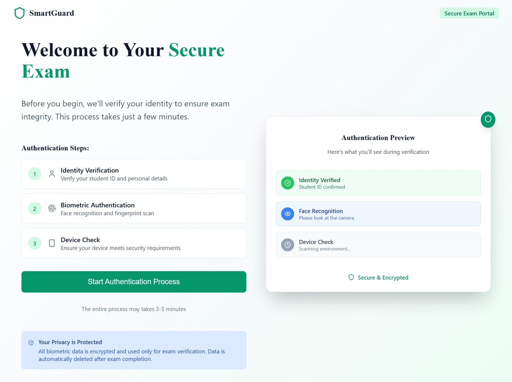
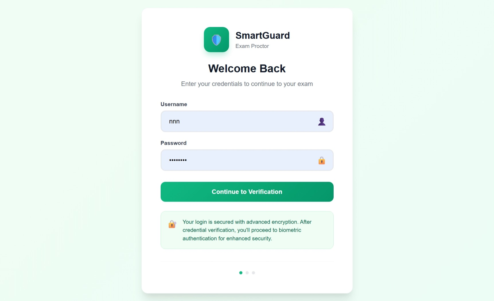
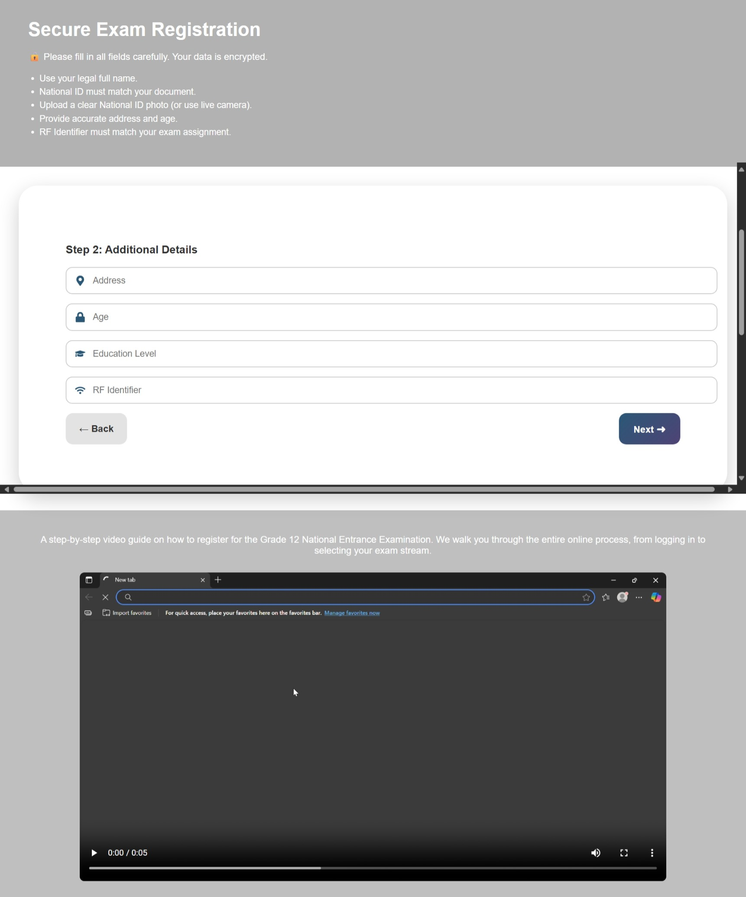
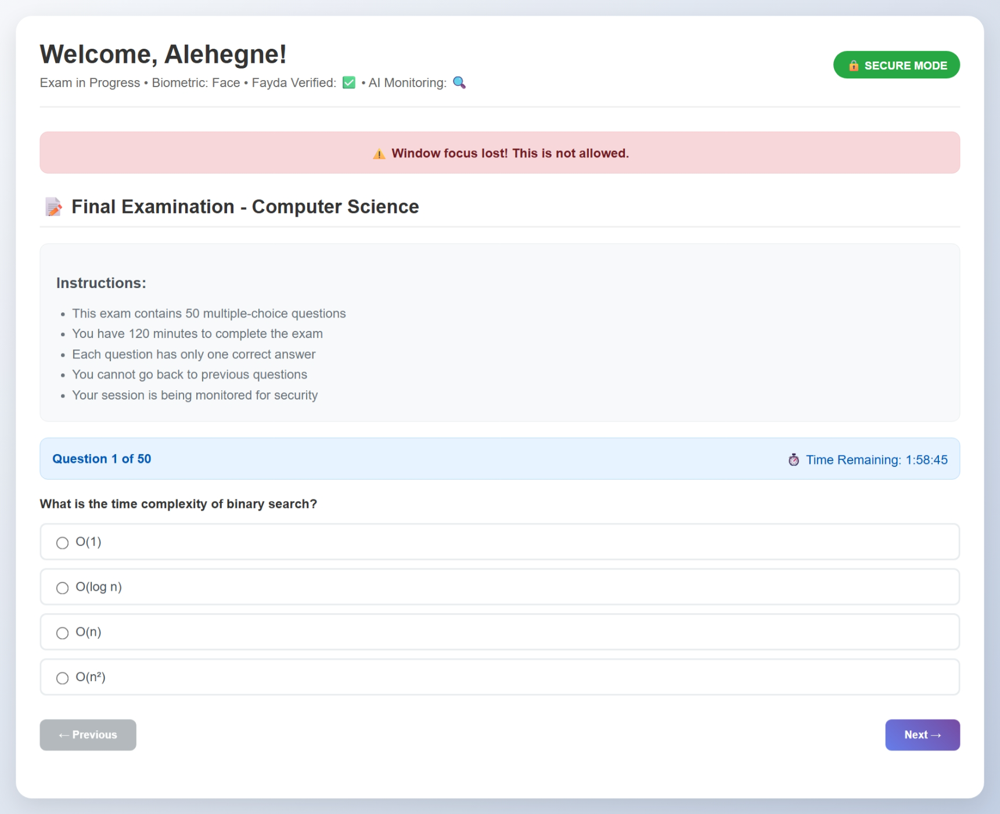

# 🛡️ Smart-Exam

## 🧠 Project Synopsis:

### 🛑 Problem Statement:

Online exams face major challenges:

1. **Identity Fraud** – Anyone could impersonate a student during online exams.
2. **Cheating Detection** – Participants can use external devices like phones, Bluetooth earbuds, or other wireless tools to cheat during exams.
3. **Lack and unclear orientation- loss of confidence** -Has the centeralzed orientaion for all the country even the world and can be notice if there is fualt for all the student if there is a doubtfull things happen
4. **independet regsuter system** Any student who has regiter in the eduction system can be register by login the username and the password that given by the eduction system: this helps to create the safe for student and to control the student no number and related info b/ce the exam

There is no affordable and intelligent system in Ethiopia that combines identity verification and real-time cheating prevention in remote assessments.

---

### ✅ Implemented Solution:

**SmartGuard Exam Proctor** — an advanced online examination monitoring system that solves these challenges using:

- **Multi-Biometric Authentication** – Face, Iris, and Fingerprint recognition for secure login
- **AI Behavioral Monitoring** – Real-time webcam monitoring for suspicious activities
- **Device Detection** – Background scanning for unauthorized wireless devices
- **Real-Time Alerts** – Comprehensive dashboard for supervisors with detailed device and location info
- **Secure Exam Environment** – Prevents tab switching, copy/paste, and unauthorized access
- **Chat assistance and live video stream** - Give centralzed orientation for the exam takers,
- **Oriention** - for easly understandable in form of centerlized for every student in one voice and meaning
- **Fayda Integration** – Post-login redirect to Fayda for additional national ID verification

---

### 🎯 Achieved Outcomes:

- ✅ **Professional Landing Page, exam inteface page, regietr page, orinteion and the rule of the exam page** - Beautiful, modern UI with smooth animations
- ✅ **Two-Step Authentication** - Credentials + Biometric verification
<!-- - ✅ **Fayda Integration** - Seamless redirect to national ID system after login -->
- ✅ **Advanced Exam Interface** - Professional exam environment with real-time monitoring
- ✅ **AI-Powered Monitoring** - Behavioral detection using MediaPipe and OpenCV
- ✅ **Comprehensive Dashboard** - Real-time alerts with device and location tracking
- ***

This ensures:

- **Double Verification** - Both biometric and national ID verification
- **Compliance** - Meets Ethiopian government requirements
- **Security** - Multiple layers of identity verification

---
**System Architecture**


--- 

## 💻 Tech Stack:

### Frontend:

- **React.js** – Modern UI with hooks and functional components
- **CSS-in-JS** – Inline styling for consistent design
- **WebSocket** – Real-time communication with backend
- **WebRTC** – Camera access for biometric capture

### Backend:

- **Django + Django REST Framework** – Robust API backend
- **Django Channels** – WebSocket support for real-time alerts
- **MYSQL** – Reliable database storage
- **Face Recognition** – Advanced biometric processing
- **OpenCv and other computer vission** - process the image etc for biomtric

### AI & Monitoring:

- **OpenCV** – Computer vision for behavioral analysis
- **MediaPipe** – Face mesh, pose, and hand detection
- **YOLOv8** – Object detection for suspicious items
- **NumPy** – Numerical computations

### Security Features:

- **Multi-Factor Authentication** – Username/password + biometric
- **Real-time Monitoring** – Behavioral and device detection
- **Secure Communication** – WebSocket encryption
- **Session Management** – Secure exam sessions

---

## 🛠️ Installation and Deployment

### 1. Prerequisites

- **Python 3.11+** (Tested with Python 3.13.5)
- **Node.js 18+** (Tested with Node.js 22.14.0)
- **Docker & Docker Compose** (for containerized deployment)
- **Git** (for cloning the repository)

### 2. Clone the Repository

```bash
git clone https://github.com/Maxd646/Smart-Exam-site
cd backend
cd frontend
cd register_service
```

### 3. Install Dependencies

#### Backend (Django)

```bash
cd backend
pip install -r requirements.txt
```

**Note**: Some packages like `dlib` and `face-recognition` may require additional system dependencies:

- **Windows**: Install Visual Studio Build Tools
- **Linux**: `sudo apt-get install cmake libopenblas-dev liblapack-dev libjpeg-dev`
- **macOS**: `brew install cmake openblas lapack libjpeg`

#### Frontend (React)

```bash
cd ../frontend
npm install
```

### 4. Environment Setup

Create a `.env` file in the root directory:

```bash
# Django Settings
DEBUG=True
SECRET_KEY=your-secret-key-here-change-in-production
ALLOWED_HOSTS=localhost,127.0.0.1

# Database Settings
DATABASE_URL=postgresql://newuser:QAZwsx123#@db:5432/my_db

# Security Settings
CORS_ALLOWED_ORIGINS=http://localhost:3000,http://127.0.0.1:3000
```

### 5. Running the App Locally

#### Start the Backend (Django)

```bash
cd backend
python manage.py migrate  # Run migrations if needed
python manage.py runserver
```

#### Start the Frontend (React)

Open a new terminal:

```bash
cd frontend
npm start
```

**Access Points:**

- **Frontend**: http://localhost:3000
- **Backend API**: http://localhost:8000
- **Admin Dashboard**: Available via supervisor button

### 6. Deploying with Docker

#### Prerequisites

Ensure Docker and Docker Compose are installed:

```bash
docker --version
docker-compose --version
```

#### Build and Run All Services

```bash
# Build and start all services
docker-compose up --build

# Run in background (detached mode)
docker-compose up --build -d
```

**What this does:**

- Builds the frontend React application
- Builds the backend Django application
- Starts PostgreSQL database
- Sets up networking between services
- Mounts volumes for data persistence

#### Access the Application

- **Backend API**: http://localhost:8000
- **Frontend**: The React app is built and served by Django at http://localhost:8000

#### Stopping the Services

```bash
# Stop and remove containers
docker-compose down

# Stop and remove containers + volumes
docker-compose down -v
```

#### Troubleshooting Docker

```bash
# View logs
docker-compose logs

# View logs for specific service
docker-compose logs web
docker-compose logs db

# Rebuild without cache
docker-compose build --no-cache

# Remove all containers and images
docker-compose down --rmi all --volumes --remove-orphans
```

### 7. Running Tests

```bash
# Run integration tests
python test_fayda_integration.py

# Run complete system tests
python test_complete_system.py
```

---

## 🚀 Quick Start:

### Prerequisites:

```bash
# Install Python dependencies
pip install -r backend/requirements.txt

# Install Node.js dependencies
cd frontend && npm install
```

### Running the System:

```bash
# Start Django backend
cd backend && python manage.py runserver

# Start React frontend (in new terminal)
cd frontend && npm start

# Run integration tests
python test_fayda_integration.py
```

### Access Points:

- **Frontend**: http://localhost:3000
- **Backend API**: http://localhost:8000
- **Admin Dashboard**: Available via supervisor button

---

## 🧪 Testing:

Run the comprehensive test suite:

```bash
python test_fayda_integration.py
```

This tests:

- ✅ Backend API endpoints
- ✅ Fayda callback integration
- ✅ Behavioral monitoring
- ✅ Alert system functionality

---

## 📊 Features Overview:

| Feature                        | Status      | Description                                          |
| ------------------------------ | ----------- | ---------------------------------------------------- |
| Landing Page                   | ✅ Complete | Professional UI with animations                      |
| traditional login              | ✅ Complete | For regiter and the start exam then biometric        |
| Multi-Biometric Login          | ✅ Complete | Face, Iris, Fingerprint support                      |
| Exam Interface                 | ✅ Complete | Professional exam environment                        |
| Real-time Alerts               | ✅ Complete | Comprehensive supervisor dashboard                   |
| Live stream                    | ✅ complete | Give one centerized oriention from Higer office      |
| student register               | ✅ complete | regiter independ and any place                       |
| secure extention               | ✅ complete | secure the exam in any browser                       |
| Behavioral Monitoring          | Incomplete  | AI-powered webcam monitoring                         |
| Device Detection               | Incomplete  | RF and network scanning                              |
| chatBot                        | Incomplete  | Give any explanition for the student                 |
| Regiter form( 2nd microsevice) | planning    | Studnt can be own regster system                     |
| Fayda Integration              | Planning    | Student give the FAYDA number for Biomtric and other |

---

> 🎉 **Ready for Production Deployment** - This system combines **identity verification**, **AI monitoring**, and **real-time security** to create a trustworthy online examination platform for Ethiopia.

## Contributors:

- Daniel Gashaw Kebede(https://github.com/Maxd646)

---
**Sample demo*8




